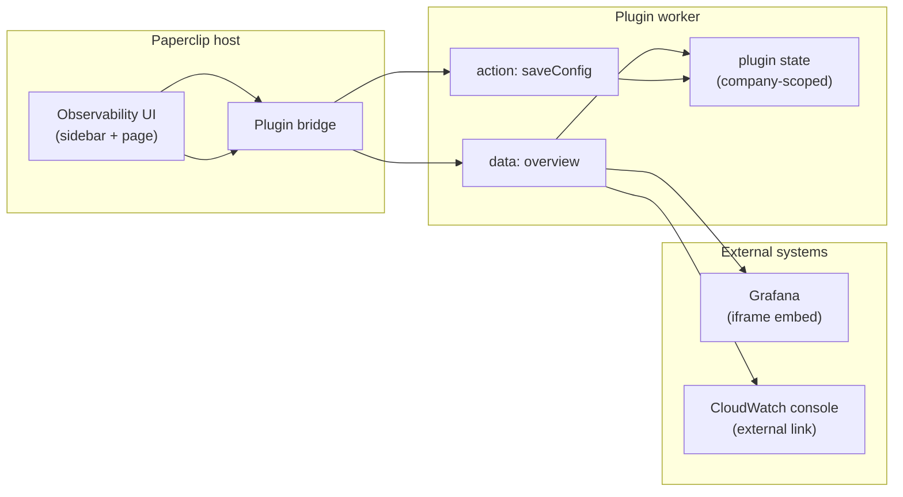

# Paperclip Observability Plugin

Source: [gauderp/paperclip-plugin-observability](https://github.com/gauderp/paperclip-plugin-observability) · npm: `@gaud_erp/papperclip_observability@0.1.0`

Bring **Grafana dashboards** and **AWS CloudWatch** into [Paperclip](https://github.com/paperclipai/paperclip) so operators and engineers can check production health without leaving the company workspace.

| | |
|---|---|
| **What it does** | Adds an **Observability** sidebar entry and a full-page view at `/:company/observability` |
| **Providers** | Grafana (embedded iframe) · CloudWatch (deep link to AWS console) |
| **Scope** | Per-company configuration stored in plugin state |
| **Version** | 0.1.0 — sidebar, config UI, embed/link panel |

## Overview

Paperclip runs agent workflows, issues, and company workspaces. When something misbehaves in production, teams usually context-switch to Grafana or the AWS console. This plugin keeps that context **inside Paperclip**:

1. Install the plugin on your Paperclip instance.
2. Open **Observability** in the sidebar for a company.
3. Choose Grafana or CloudWatch and save URLs/regions.
4. View metrics on the same page — Grafana loads in an iframe; CloudWatch opens via a secure external link (AWS blocks reliable iframe embed).


## Architecture



| Component | Role |
|-----------|------|
| `src/manifest.ts` | Registers sidebar slot `observability-nav` and page route `observability` |
| `src/ui/index.tsx` | React UI: status cards, provider form, Grafana iframe, CloudWatch link |
| `src/worker.ts` | Resolves `overview` data and persists `saveConfig` per company |
| Plugin state key | `observability.config` — `{ provider, grafanaUrl?, cloudwatchRegion? }` |

## Features

### Available in v0.1

- **Sidebar navigation** — `Observability` link in the company sidebar (`observability-nav` slot).
- **Dedicated page** — `/:company/observability` with status badge, provider summary, and configuration form.
- **Grafana** — embeds your Grafana base URL in kiosk/TV mode (`?kiosk=tv`) for a chromeless dashboard view.
- **CloudWatch** — builds a regional AWS console URL; users open metrics in a new tab (iframe not supported by AWS).
- **Per-company settings** — each Paperclip company can point at different Grafana instances or AWS regions; plugin **Settings** page (`settingsPage` slot) mirrors the Observability page form.
- **AWS access (secret refs)** — CloudWatch provider accepts company secret references for access key id and secret key, with **Test AWS access** in the worker.
- **Health check** — worker `onHealth` reports plugin availability to the host.

### Planned

- Embedded CloudWatch widgets where AWS APIs allow
- Auth and secrets integration (API keys, IAM roles) instead of URL-only config
- Telemetry contracts for agent-run metrics inside Paperclip

## Requirements

- Paperclip host **2026.517** or newer
- Node.js **20+**
- For Grafana embed: a reachable Grafana URL and browser/CSP rules that allow iframe embedding from your Paperclip origin

## Quick start

### Install on a running Paperclip instance

Requires the Paperclip CLI and **instance-admin** board auth (agent API keys cannot install plugins).

**Windows / CLI not in PATH:** install the CLI once, then open a **new** PowerShell window:

```powershell
npm install -g paperclipai@2026.517.0
paperclipai --version
```

If `paperclipai` is still not recognized, prefix commands with `npx` or use the full path:

```powershell
npx --yes paperclipai@2026.517.0 auth login --instance-admin --api-base http://127.0.0.1:3100
npx --yes paperclipai@2026.517.0 plugin install @gaud_erp/papperclip_observability@0.1.0 --api-base http://127.0.0.1:3100
npx --yes paperclipai@2026.517.0 plugin inspect paperclip.observability --api-base http://127.0.0.1:3100
```

**Unix / global CLI on PATH:**

```bash
paperclipai auth login --instance-admin --api-base http://127.0.0.1:3100
paperclipai plugin install @gaud_erp/papperclip_observability@0.1.0 --api-base http://127.0.0.1:3100
paperclipai plugin inspect paperclip.observability --api-base http://127.0.0.1:3100
```

`auth login` prints an approval URL — open it in the browser, approve instance-admin access, then rerun `plugin install`.

```bash
# Local dev path (still requires instance admin)
paperclipai plugin install /absolute/path/to/paperclip-plugin-observability
```

Paperclip watches `dist/` for local-path installs and reloads the worker after rebuilds.

### Configure a company

1. Select the company in Paperclip.
2. Open **Instance Settings → Plugins → Observability** (settings tab), **or** click **Observability** in the company sidebar.
3. Under **Provider configuration**, choose **Grafana** or **CloudWatch**.
4. For Grafana: enter the **Grafana base URL** (e.g. `https://grafana.example.com`).
5. For CloudWatch: enter **AWS region** (e.g. `us-east-1`) and, for API access, the **secret references** for your AWS access key id and secret access key (create them under **Company → Secrets** first).
6. Click **Save configuration** (use **Test AWS access** to verify secret refs resolve).
7. Refresh — Grafana shows an embedded dashboard; CloudWatch shows an **Open CloudWatch console** link.

| Provider | Config field | What you see after save |
|----------|--------------|-------------------------|
| Grafana | Base URL | Iframe with dashboard (`kiosk=tv`) |
| CloudWatch | Region | Link to `https://{region}.console.aws.amazon.com/cloudwatch/...` |
| None | — | Status **Not configured** with setup prompt |

## Development

```bash
pnpm install
pnpm dev        # watch-build worker, manifest, and UI into dist/
pnpm typecheck
pnpm test
pnpm build
```

### Project layout

```
paperclip-plugin-observability/
├── docs/
│   └── ui-overview.svg      # README diagram (wireframe)
├── src/
│   ├── manifest.ts          # Plugin registration
│   ├── worker.ts            # Data + actions + state
│   └── ui/index.tsx         # Sidebar + page components
├── tests/plugin.spec.ts
└── dist/                    # Built artifacts (required for install)
```

### Capabilities declared

`plugin.state.read`, `plugin.state.write`, `ui.sidebar.register`, `ui.page.register`, `metrics.write`

## Screenshots

Replace or supplement `docs/ui-overview.svg` with real captures after installing locally:

1. Run `pnpm dev` and install the plugin path into Paperclip.
2. Configure Grafana or CloudWatch for a test company.
3. Save PNGs under `docs/screenshots/` and link them here.

Suggested filenames: `sidebar.png`, `config-form.png`, `grafana-embed.png`.

## License

MIT — see [LICENSE](./LICENSE).

## Repository

Public source: [github.com/felipeespitalher/paperclip-plugin-observability](https://github.com/felipeespitalher/paperclip-plugin-observability)
